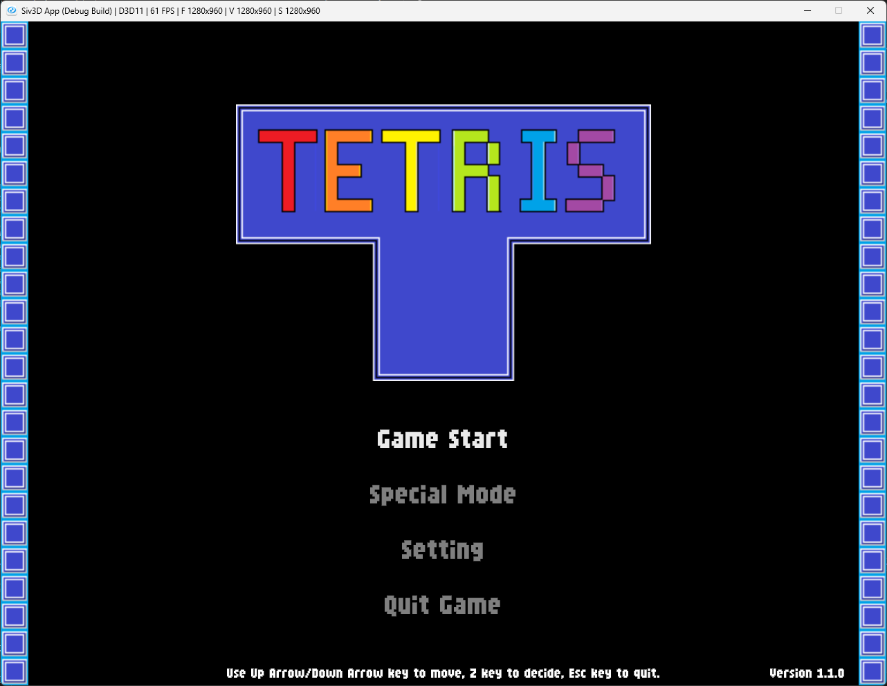
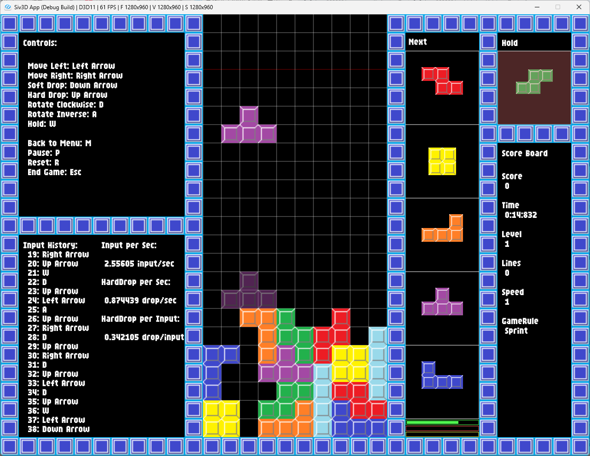
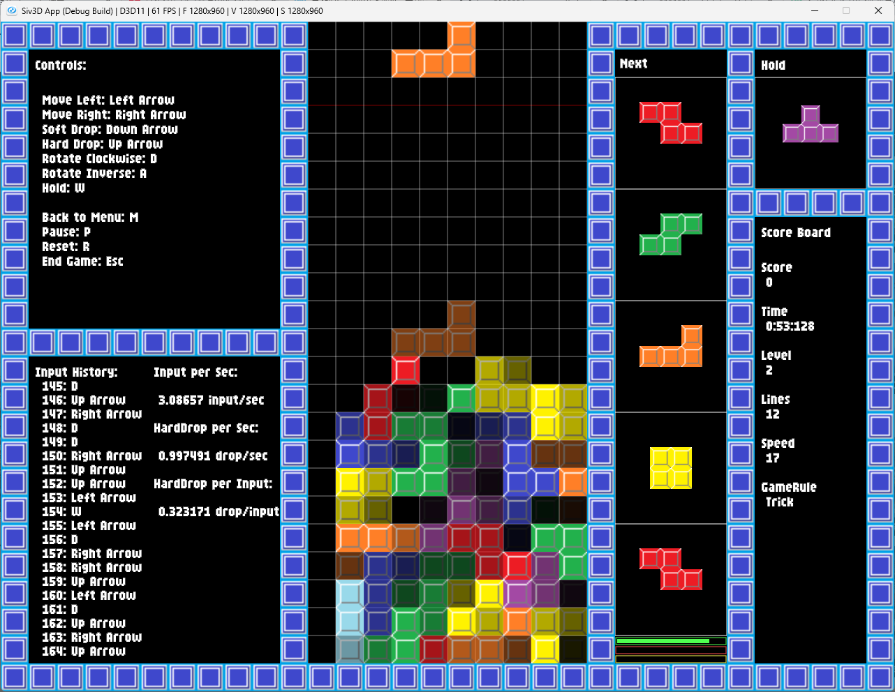
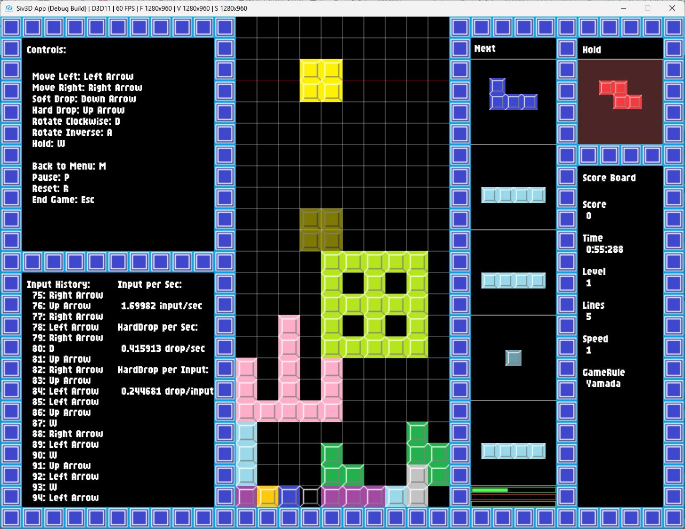
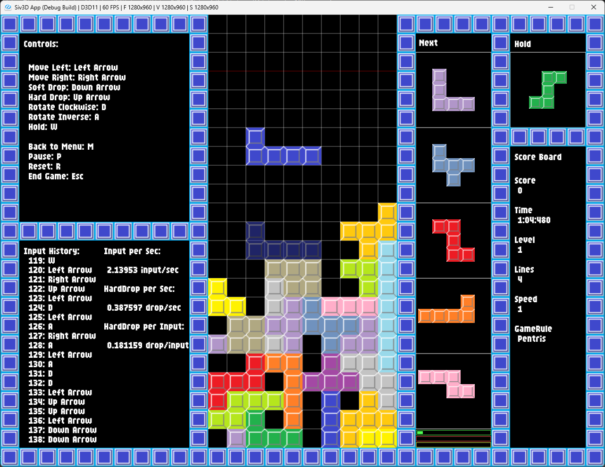

# Tetris

    

        
    

DxLibで作成したテトリスをSiv3d for Webで書き直したものです.

<b>以下のリンクからプレイできます.</b>

https://hase111111.github.io/siv3d-tetris/

## 更新履歴

- ver 1.0.0
    - 初回リリース

- ver 1.0.1
    - 一部のブラウザで動作しない不具合を修正
    - 時間の表示が正しくない不具合を修正

- ver 1.1.0
    - トリックモードの追加
    - 入力履歴を表示する機能の追加

- ver 1.2.0
    - プラクティスモードの追加
    - Settingsメニューの追加
        - ゲームプレイ時の変数を調整可能に
    - スコアの追加
    - 不具合の修正
        - アナウンスの表示がポーズのUIと被る不具合を修正
        - トリックモードでエフェクト切り替え時に，エフェクトが重複する不具合を修正
    - その他軽微な修正
        - トリックモードにエフェクトを追加
        - Input per Secondの表示を調整
        - ペントリスモードの難易度を易化

## 今後のアップデート予定

- BGM, SEの追加

   - 現在は無音ですが, 今後BGMとSEを追加する予定です.

- Key Configの実装

   - 現在は固定のキー配置でプレイ可能ですが, 今後はキー配置をカスタマイズできるようにする予定です.

- CPU対戦モードの実装

   - 対戦モードを実装したいと考えています. 現在はシングルプレイのみ対応しています.

## スクリーンショット

    

        
        
    

    

        
        
    

